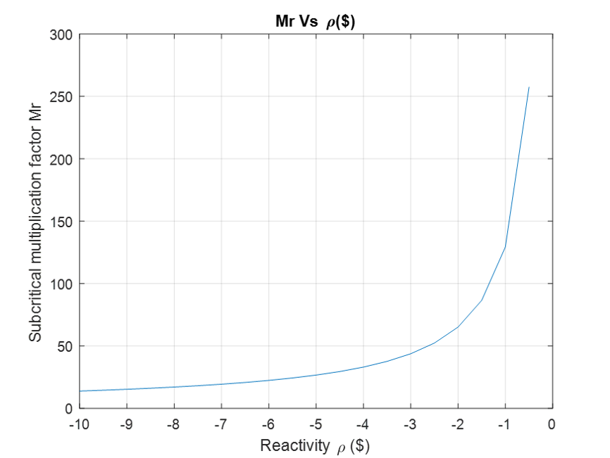
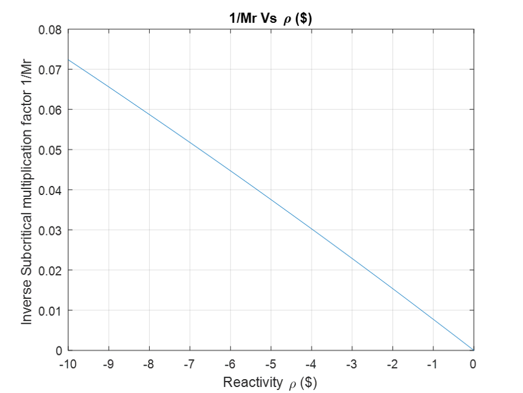
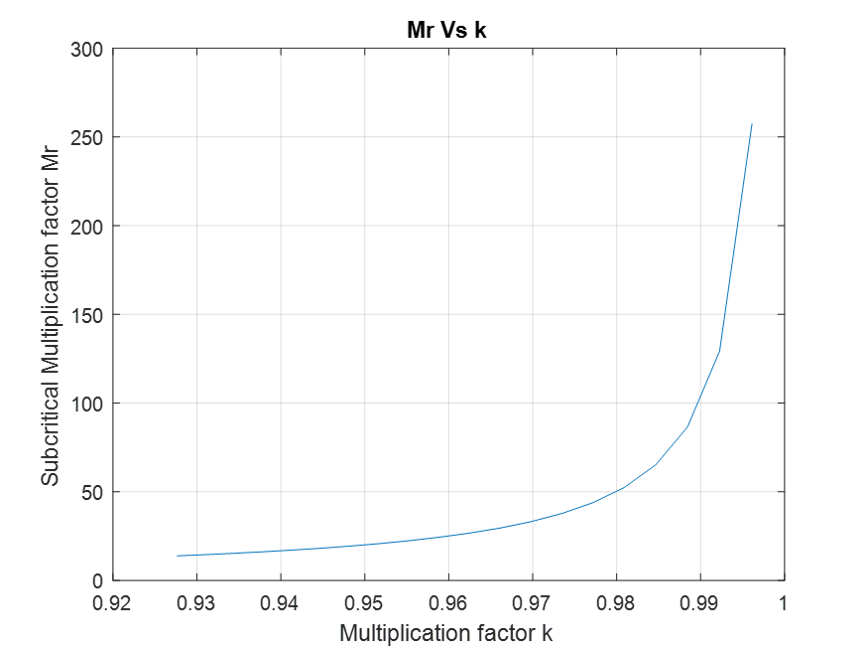
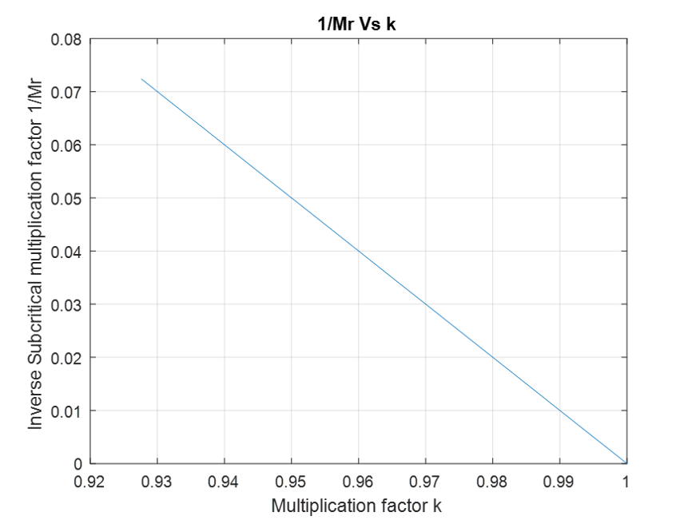

# Approach-to-Critical

Use the concept of the subcritical multiplication factor to predict the critical height of a control blade within a research reactor.

Performing an “Approach to Critical” experiment by plotting the traditional 1/M curves is an excellent means for illustrating the behavior of subcritical systems, for highlighting the importance of the subcritical multiplication factor, and for showing how knowledge of the detector count rate in different configurations can give an experimental methodology for predicting when a system will reach the critical state.  

# Script 1

The script written in ``` code1.m``` creates a series of plots that show the relative count rate or relative subcritical multiplication factor (i.e. Mr(ρ) = C(ρ)/Co) versus subcriticality level, ρ.  In particular, it generate the following four plots with ρ starting at ρo = -10 dollars: 

Mr vs ρ ,  1/Mr vs. ρ ,   Mr vs k   and  1/Mr vs. k

**Output**

<p align="center"> 

</p>

<p align="center"> 

</p>

<p align="center"> 

</p>

<p align="center"> 

</p>

The curves are meaningful as they follow the theory and equations.
In the case of Mr vs ρ: Mr should increase exponentially as ρ increases and Mr → ∞as ρ→ 0.
In the case of 1/Mr vs ρ: Mr should decrease linearly as ρ increases, and 1/Mr →0 as ρ → 0.
In the case of Mr vs K: Mr should increase exponentially with k’s increase, and M → ∞ as k approaches 1.
In the case of 1/Mr vs K: Mr should decrease linearly with k’s increase, and 1/Mr → 0 as k → 1.
The 1/Mr vs ρ or 1/Mr vs k graphs are more informative, since the x-intercept represents criticality and is much easier to read.

# Script 2

The you should use the pkeqns_nofdbk.m function to 

In order to simulate the behavior of a subcritical system with a series of positive step changes in reactivity, I wrote ```pksim_test.m``` code which uses the ```pkeqns_nofdbk.m``` code (written by J. R. White).  At each step, the level of subcriticality should be reduced by a factor of two until one gets close to critical  --  within -0.5 dollars should be sufficient to show the desired behavior here. The simulation starts at steady state subcritical with ρo = -10 dollars and add sufficient positive reactivity at each step to reduce the total reactivity by a factor of two each time.  Using the kinetics data for the UMLRR, including the source strength, S, and other parameters as obtained from the ```kinetics_data.m``` function file.  I used the ```pksim_test.m``` file as a starting point, making sure that the initial conditions set properly and that I get the tt and rhot vectors to mimic the desired sequence of step reactivity changes. 

The Matlab code ```pksim_test.m``` was developed to simulate a steady, subcritical state with ρo = -10 dollars. Each time, sufficient positive reactivity was added at each step to reduce the total reactivity by a factor of two. By plotting P(t)/P_0 vs time, the sudden change in power were more understandable. The reactivity graphs show the effect of adding reactivity until the system reached near criticality. The result make sense as it is consistent with the theory. In case P_0 was chosen to be a larger number, the effect of the initial negative reactivity will be noticed (huge prompt drop). 

$$
k=\frac{1}{1-\rho}=\frac{1}{1-\left(-10\times\beta\right)}=0.92764 \\
M=\frac{1}{1-k}=13.82 \\
N=M\times S=13.82\times1.3\times{10}^7=1.797\times{10}^8\ n/s \\
\frac{dP}{dt}=\frac{\rho-\beta}{\Lambda}P\left(t\right)+\frac{\beta}{\Lambda}P_0 \\
\frac{dP}{dt}=0==>P_0=P\left(t\right)\times\frac{\beta-\rho}{\beta} \\
\frac{P\left(t\right)}{P_0}=\frac{\beta}{\beta-\rho}==>\frac{XP_0}{P_0}=X=\frac{\beta}{\beta-\rho} \\
where:\beta=0.0078\ and\ \rho=-10\times\beta \\
X=\frac{\beta}{\beta+10\beta}=\frac{1}{11}
$$

<p align="center"> 

</p>

<p align="center"> 

</p>
